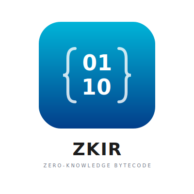

<p align="center">
  
</p>

[](https://doi.org/10.5281/zenodo.17747636)

> **Paper:** [ZK IR: A Minimalist Instruction Set Architecture for Efficient Zero-Knowledge Proof Generation](https://zenodo.org/records/17747636)
>
> Mamone Tarsha-Kurdi, SECEQ Research

A 32-bit register-based instruction set and runtime designed for efficient zero-knowledge proof generation with Plonky3.

## Overview

ZK IR is a RISC-V inspired bytecode format optimized for ZK proof generation. It features a simplified 32-bit architecture with syscalls for cryptographic operations, making it ideal for proving computation with Baby Bear field arithmetic.

**Key Features:**
- 32-bit RISC-V compatible instruction encoding
- Baby Bear prime field (p = 2^31 - 2^27 + 1)
- No field registers (uses syscalls for crypto operations)
- Register pairs for 64-bit values
- Minimal constraints per instruction
- Syscalls for Poseidon2, SHA-256, ECDSA, etc.

```
Rust Source → LLVM IR → ZK IR → Runtime → Plonky3 Proof
```

## Quick Start

### Prerequisites

- Rust 1.75+ (install from https://rustup.rs)
- Cargo

### Build

```bash
# Clone the repository
git clone <your-repo-url>
cd zkir

# Build all crates
cargo build --all

# Run tests
cargo test --all

# Build release version
cargo build --all --release
```

## Architecture

```
┌─────────────────────────────────────────────────────────────────┐
│                    ZK IR Architecture                           │
├─────────────────────────────────────────────────────────────────┤
│                                                                 │
│  Integer Registers (32 × 32-bit):                               │
│  ┌─────┬─────┬─────┬─────┬─────┬─────┬─────┬─────┬───────────┐  │
│  │  r0 │  r1 │  r2 │  r3 │ r4  │ r5  │ r6  │ r7  │ r8-r31    │  │
│  │ =0  │  rv │  sp │  fp │ a0  │ a1  │ a2  │ a3  │ temp/saved│  │
│  └─────┴─────┴─────┴─────┴─────┴─────┴─────┴─────┴───────────┘  │
│                                                                 │
│  NO field registers (use syscalls for crypto)                   │
│                                                                 │
│  Memory: 32-bit addressable, 32-bit words, little-endian        │
│  Field: Baby Bear (p = 2^31 - 2^27 + 1)                         │
│                                                                 │
└─────────────────────────────────────────────────────────────────┘
```

## Documentation

- **[SPECIFICATION.md](SPECIFICATION.md)** - Complete ISA specification

## Example: Fibonacci

```asm
.section .text
.global _start

_start:
    read    a0              ; n = input
    jal     ra, fib         ; call fibonacci
    write   rv              ; output result
    halt

; Fibonacci function
; Input: a0 = n
; Output: rv = fib(n)
fib:
    li      t0, 2
    blt     a0, t0, fib_base

    ; Iterative fibonacci
    li      t0, 0           ; prev = 0
    li      t1, 1           ; curr = 1
    li      t2, 1           ; i = 1

fib_loop:
    beq     t2, a0, fib_done
    add     t3, t0, t1      ; next = prev + curr
    mv      t0, t1          ; prev = curr
    mv      t1, t3          ; curr = next
    addi    t2, t2, 1       ; i++
    j       fib_loop

fib_done:
    mv      rv, t1
    ret

fib_base:
    mv      rv, a0
    ret
```

## Instruction Set Overview

### Categories

- **Arithmetic**: add, sub, mul, div, divu, rem, remu, addi, etc.
- **Logic**: and, or, xor, sll, srl, sra, slt, sltu
- **Memory**: lw, lh, lb, lhu, lbu, sw, sh, sb
- **Control Flow**: beq, bne, blt, bge, bltu, bgeu, jal, jalr
- **Upper Immediate**: lui, auipc
- **System**: ecall, ebreak
- **ZK-Custom**: assert_eq, assert_ne, assert_zero, range_check, commit, halt
- **ZK I/O**: read, write, hint

### Syscalls (via ECALL)

| Number | Name | Description |
|--------|------|-------------|
| 0x01 | SYS_POSEIDON2 | Poseidon2 hash |
| 0x02 | SYS_KECCAK256 | Keccak-256 hash |
| 0x03 | SYS_SHA256 | SHA-256 hash |
| 0x04 | SYS_BLAKE3 | BLAKE3 hash |
| 0x10 | SYS_ECDSA_VERIFY | ECDSA signature verification |
| 0x11 | SYS_ED25519_VERIFY | Ed25519 signature verification |
| 0x20 | SYS_BIGINT_ADD | 256-bit addition |
| 0x21 | SYS_BIGINT_MUL | 256-bit multiplication |

## Library Usage

### zkir-spec

```rust
use zkir_spec::{Program, Instruction, Register, BabyBear};

// Create a simple program
let code = vec![
    0x00000073, // ecall
    0x0FE00F6B, // halt (placeholder encoding)
];

let program = Program::new(code);
let hash = program.hash();
```

### zkir-assembler

```rust
use zkir_assembler::assemble;

let source = r#"
    ecall
    halt
"#;

let program = assemble(source)?;
```

### zkir-disassembler

```rust
use zkir_spec::Program;
use zkir_disassembler::disassemble;

let code = vec![0x00000073]; // ecall
let program = Program::new(code);
let asm = disassemble(&program)?;
println!("{}", asm);
```

### zkir-runtime

```rust
use zkir_runtime::{VM, VMConfig};
use zkir_spec::Program;

let program = Program::new(code);
let inputs = vec![10];
let config = VMConfig::default();

let vm = VM::new(program, inputs, config);
let result = vm.run()?;
println!("Output: {:?}", result.outputs);
```

## Testing

```bash
# Run all tests
cargo test --all

# Run tests for specific crate
cargo test -p zkir-spec
cargo test -p zkir-assembler
cargo test -p zkir-disassembler

# Run with output
cargo test -- --nocapture
```

## Contributing

Contributions welcome! Please:

1. Follow the existing code style
2. Add tests for new functionality
3. Update documentation
4. Run `cargo fmt` and `cargo clippy` before submitting

## Performance Targets

| Metric | Target |
|--------|--------|
| Execution speed | > 50M cycles/sec |
| Trace generation | > 10M steps/sec |
| Constraints per instruction | < 50 avg |

## License

MIT OR Apache-2.0
